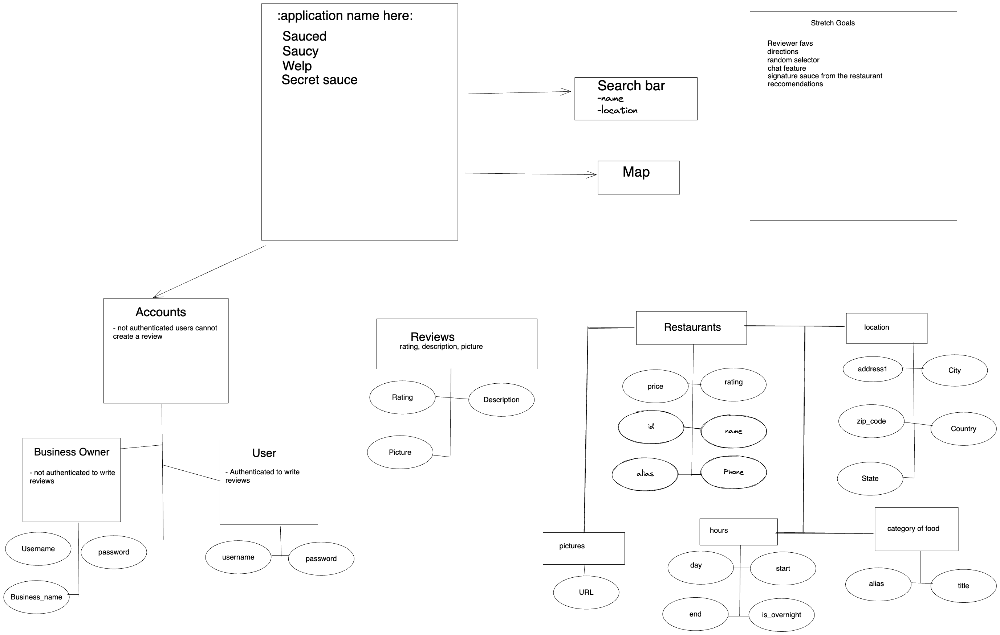

# API

* Rapid API https://rapidapi.com/blog/best-travel-apis-guide/
* https://openweathermap.org/current#geo
* https://www.yelp.com/developers/documentation/v3/get_started
* https://developers.google.com/maps/documentation/javascript/get-api-key

## Potential add list
* Restaurant info


## Search a restaurant 

* **Method**: `GET`
* **Path**: /api/restaurants



Output:

```json
{
    "rating": 4.5,
    "price": "$$",
    "phone": "+14154212337",
    "id": "molinari-delicatessen-san-francisco",
    "categories": [
        {
            "alias": "delis",
            "title": "Delis"
        }
    ],
    "review_count": 910,
    "name": "Molinari Delicatessen",
    "url": "https://www.yelp.com/biz/molinari-delicatessen-san-francisco",
    "coordinates": {
        "latitude": 37.7983818054199,
        "longitude": -122.407821655273
    },
    "image_url": "http://s3-media4.fl.yelpcdn.com/bphoto/6He-NlZrAv2mDV-yg6jW3g/o.jpg",
    "location": {
        "city": "San Francisco",
        "country": "US",
        "address2": "",
        "address3": "",
        "state": "CA",
        "address1": "373 Columbus Ave",
        "zip_code": "94133"
    }
}
```

Search for businesses by keyword, category, location, price level, etc.
Returns data with a list of matche(s).
